# Tuning Garage — User Guide

A file-based system for tracking DIY engine tuning: versioned tune files,
session logs, datalog analysis, and a learning tracker, with a local web app on
top. It sits **around** your tuning tools — HP Tuners, PCMHammer,
UniversalPatcher, TunerPro — and never replaces them.

---

## 1. Read this first

> **Engine tuning can destroy expensive hardware, quickly.** A lean mixture or
> too much ignition advance under load can hole a piston before you can lift.
> An interrupted write can leave a control module unrecoverable — this project
> exists partly because its author lost three of them.
>
> **This software produces draft readings, not advice.** Every number it shows
> is arithmetic performed on data you supplied and definition files written by
> strangers. Either can be wrong.
>
> **It never writes to your vehicle.** Every change is applied by you, by hand,
> in your tuning software, on your authority.
>
> Full text: **[DISCLAIMER.md](DISCLAIMER.md)** — read it before your first flash.

---

## 2. What this is, and what it isn't

**It is** the layer that remembers: which file is in the car, what changed
between two revisions, what the last datalog actually said, what you'd already
learned six months ago and forgot.

**It is not** an editor, a flashing tool, or an autotuner. It does not open a
serial port. Table edits happen in HP Tuners or TunerPro; writes happen in
PCMHammer or your commercial suite; checksum repair happens in
UniversalPatcher.

The rules it enforces exist because each one has cost somebody something:

| Rule | Why |
|---|---|
| The stock read is sacred | An archived baseline is the difference between a five-minute recovery and a subscription, an internet connection and an afternoon |
| Never edit a revision in place | `v003` is the record of what was actually flashed. A change is `v004` |
| One change at a time | Two changes at once and you can't attribute the result to either |
| Every datalog names its revision | A log you can't tie to a tune is a log you can't act on |
| Prove your write adapter | See the disclaimer. Three modules |

---

## 3. Install

About fifteen minutes, three tools: **Git**, **Node.js LTS** and the **GitHub CLI**.

- **Windows** — follow **[SETUP-WINDOWS.md](SETUP-WINDOWS.md)**, which lists every
  installer option that matters (there are several, and the defaults aren't all
  right). An HTML version with clickable links is at `SETUP-WINDOWS.html`.
- **macOS** — follow **[SETUP-MAC.md](SETUP-MAC.md)**. Short version:
  `brew install git node gh`.
- **Linux** — your package manager for the same three tools, then follow the
  macOS guide from step 2; only the launchd autostart section does not apply.

Both guides walk you through **creating your own private repository**, which is
the step that matters most. The short version, in a browser:

> Open <https://github.com/ktollison/tuning-garage>, click **`Use this
> template`** → **`Create a new repository`**, name it `Tuning`, and select
> **`Private`**. Then `gh repo clone YOUR-USERNAME/Tuning Tuning`.

Why it has to be private:

> Your repo will hold calibration files containing **your VIN**, plus your
> datalogs and notes. It must be **private**. Git keeps history, so deleting a
> file later does not take it back — get this right at the start.

Then run the launcher (`start-tuning.sh` / `start-tuning.cmd`), which pulls from
your remote first and waits for the server before opening
<http://127.0.0.1:4590>.

On a Mac you can have it start at login and stay up on its own:

```bash
sh scripts/autostart-macos.sh install
```

That installs a launchd agent which relaunches the server if it exits. Check it
with `sh scripts/autostart-macos.sh status`, which tells you both whether the
agent is loaded and whether the port is answering. Remove it with `uninstall`.

The app binds to localhost only, refuses requests from other websites, and has
**zero dependencies** — no `npm install`, nothing phoning home. Your data stays
in your own git repo.

---

## 4. Your first fifteen minutes

### Add your vehicle

**Garage → Add a vehicle.** It scaffolds the folder structure, a profile from
the template, and an empty tune changelog.

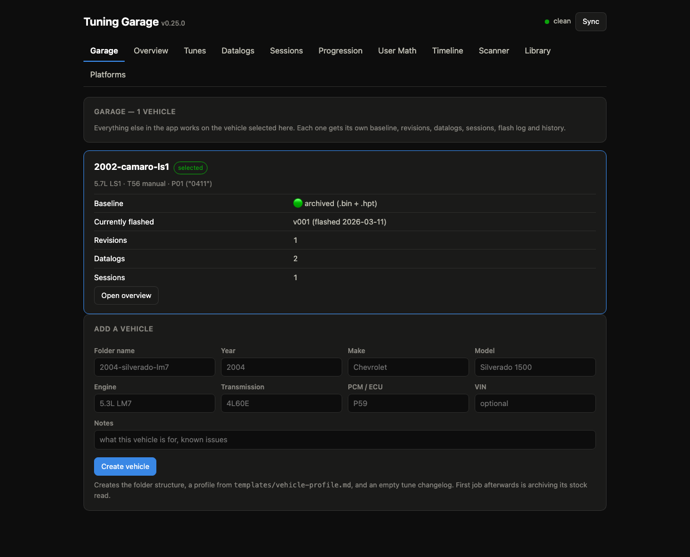

Every other tab works on whichever vehicle is selected here. Add as many as you
like — each keeps its own baseline, revisions, logs, sessions and history.

### Archive the stock read — before anything else

Read your PCM with PCMHammer (a **full** read) and upload it on the **Tunes**
tab. If your PCM is supported by both, archive **both formats**: the raw `.bin`
from PCMHammer and the `.hpt` base from HP Tuners. Two independent tools reading
the same module is also a cross-check that the read is good.

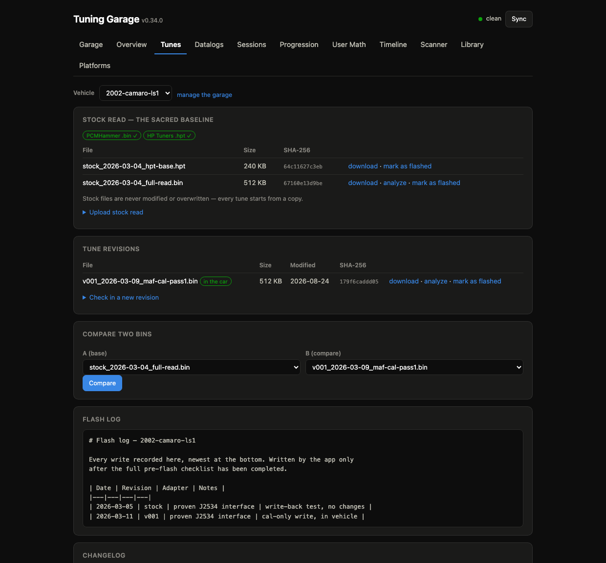

This is the single most valuable thing in the repository. With it, returning to
stock is a five-minute local flash. Without it, "stock" has to come from the
manufacturer — a subscription, an internet connection, and a working
in-vehicle programming session.

### See what the app knows about your bin

Click **analyze** on any `.bin`.

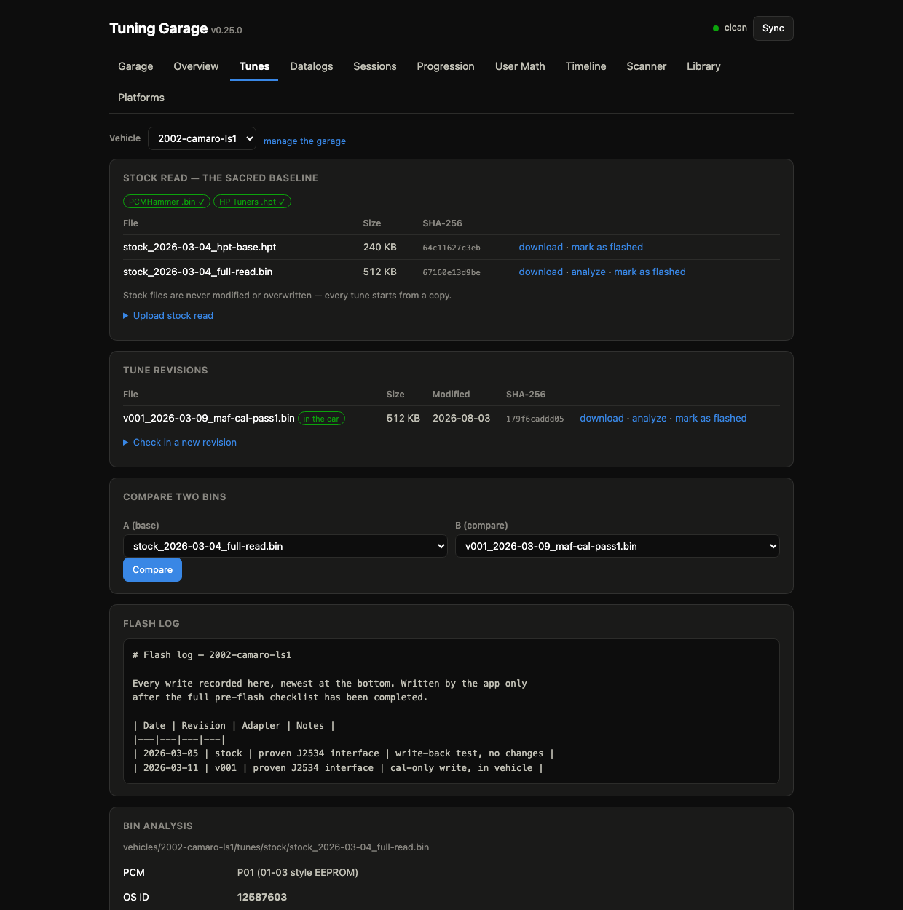

For a Gen III GM P01/P59 the app reads the file itself: PCM type, OS ID, each
segment's calibration ID, **every checksum verified**, a SHA-256 fingerprint,
and the VIN out of the EEPROM block. If the VIN doesn't match the vehicle
profile you get a loud warning — that check exists because a donor bin once
sailed through as somebody's baseline.

Checksum *verification* happens here. Checksum *repair* is UniversalPatcher's
job, deliberately.

---

## 5. The full workflow

What follows is one complete cycle, in order.

### Step 1 — Make your change, in your tuning software

Open the baseline in HP Tuners or TunerPro, make **one** change, save it under
a new name. The app doesn't edit tunes.

### Step 2 — Check the revision in

**Tunes → Check in a new revision.** Upload the file, describe the change, and
the app names it (`v001_2026-03-09_maf-cal-pass1.bin`) and writes the changelog
entry.

Have the same tune as both `.hpt` and `.bin`? Use **Check in as → v001** for the
second one. They share a revision number and one changelog entry — never two
numbers for the same tune.

### Step 3 — See exactly what changed

**Compare two bins.** Byte counts per region, and when a definition for that OS
is in your `definitions/` folder, the actual tables:

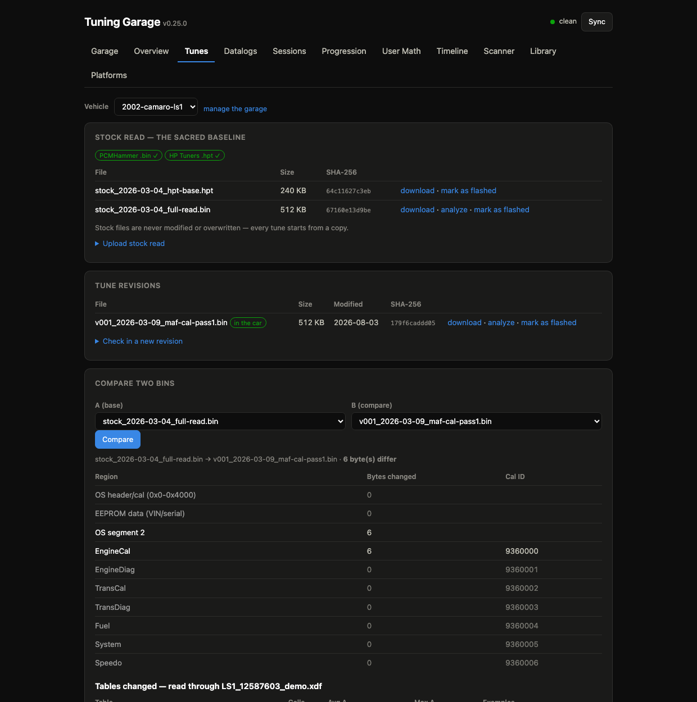

"4 bytes differ in EngineCal" becomes "MAF Airflow: 3 of 8 cells, 56.75 → 60.15
g/s". This is the answer to *"what did I actually do?"* three weeks later.

### Step 4 — Work the pre-flash checklist

**Tunes → mark as flashed** on the revision opens it. Every box must be ticked,
and the server re-checks — this is a gate, not a formality.

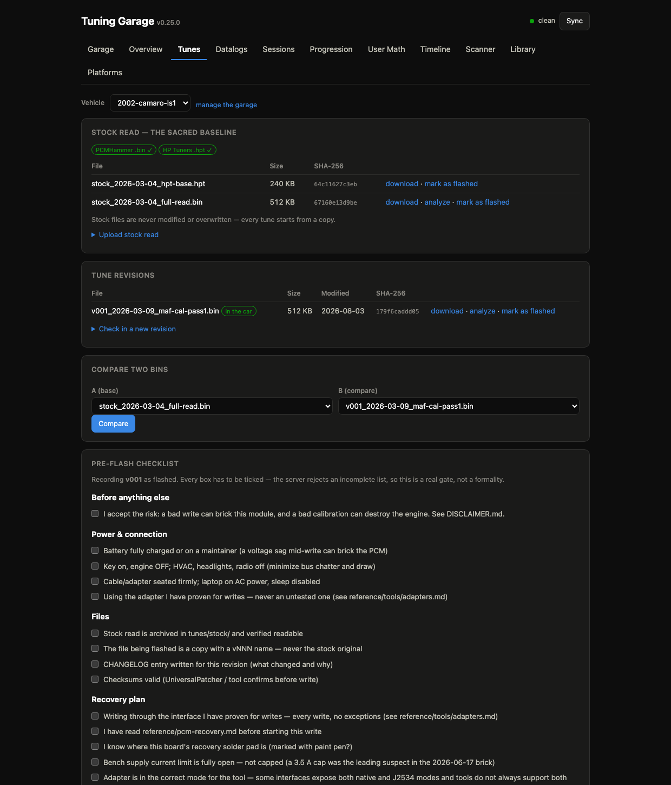

It lives in `templates/pre-flash-checklist.md`; edit that file and the app's
checklist changes with it. Add whatever your platform demands.

### Step 5 — Flash, then record it

Flash in PCMHammer or your suite. Come back, complete the checklist, and the
app records the date, revision, adapter and notes to the vehicle's flash log,
updates "currently flashed", and ticks your first-flash milestone.

The Overview then distinguishes **what's in the car** from **the newest file on
disk** — and warns when they differ:

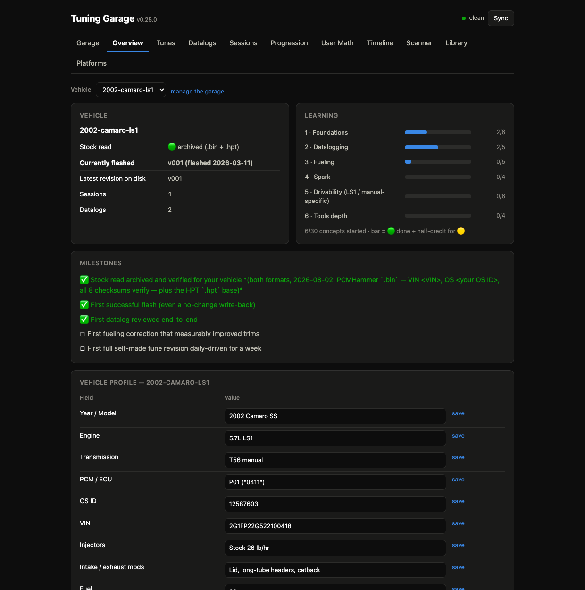

### Step 6 — Drive it and capture a datalog

Log with VCM Scanner (or PCM Logger). Then **export a CSV** — `Scan → Export`;
see [reference/vcm-scanner-csv-export.md](reference/vcm-scanner-csv-export.md)
for the channel list worth logging and why the context channels matter.

Upload both the `.hpl` and the `.csv` on the **Datalogs** tab, tagged with the
revision they ran against. The proprietary format stays readable in HP Tuners;
the CSV is what the app and every other tool can read.

### Step 7 — Read the analysis

Click **analyze trims**.

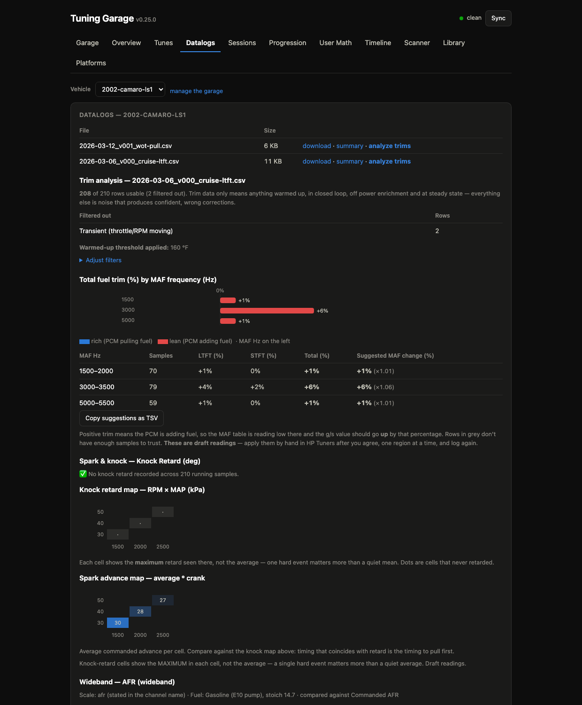

Read it top to bottom, because it's ordered by how much it should change your
mind:

**Data quality first.** How many rows survived filtering, and what was thrown
away. Trims only mean something warmed up, in closed loop, off power enrichment
and at steady state; everything else is noise that produces confident, wrong
corrections. If most of your log was rejected, that's the finding — go capture
a better log.

**Log Fuel System Status.** It is how the app knows closed loop from open loop,
and power enrichment from warm-up. Without it the app guesses from commanded
lambda and says so, and the guess counts a cold start as power enrichment. With
it, the trim section shows how often the guess and the real status agree. Under
95% agreement is flagged, because that usually means the wrong channel or a
status channel logged far less often than commanded lambda. Two differences
are expected and not counted against the channel: "not ready" while the O2
sensors heat, and decel fuel cut, both with stoich still commanded.

"Not ready" counts as warm-up while the coolant is cold, and for up to 120 s
after any engine start until closed loop is first reached, which covers a hot
restart. Outside those cases a warm, not-ready engine means closed loop was
switched off in the tune, and VE correction uses those rows.

**How channels are chosen.** A column is only used for a role if its unit fits:
throttle and trims in %, pressures in a pressure unit, temperatures in °F or
°C. Throttle logged in volts is not read as percent; if no fitting channel
exists, the role is reported missing and the reason is given. A commanded or
target channel is never used as the wideband. Gauge pressure (psig) is refused,
because absolute pressure can't be worked out without the atmospheric reading.
Unitless trims sitting near 1.0 are refused as multipliers.

**λ or EQ.** These run in opposite directions: λ below 1.00 is rich, EQ above
1.00 is rich. A unit in the header decides it. A name alone does not, because
HP Tuners' "Equivalence Ratio Commanded" is λ. Without a unit, the app works it
out from the log:

- the commanded AFR channel moves with λ and against EQ;
- no PCM commands lean at wide-open throttle;
- the narrowband O2 sensors read high when the wideband reads rich.

The basis is shown next to the channel. Only with no evidence at all does it
assume λ, with a warning that every figure inverts if that's wrong.

**Two kinds of row are left out of everything, with a warning:**

- **Rows the PCM never sent.** A logger can keep writing after the key goes
  off. Rows with module voltage below 8 V, or with every channel unchanged for
  30 s or more, are dropped. The "Filtered out" table shows them as "PCM not
  reporting".
- **Wideband readings richer than λ 0.60,** and the 2 s after each stretch. No
  running engine sits there; it is the controller switched off or still heating
  (an AEM on the ProLink analog input reads 7.31 AFR with no power). A reading
  pegged lean is kept, because that may be the engine.

**Then fuel trims by MAF frequency**, with sample counts. Positive trim means
the PCM is adding fuel, so the MAF table reads low there and that cell should go
up by that percentage. Bins with too few samples are greyed out and excluded
from the suggestion.

**Then knock and wideband** — and if either has something to say, it outranks
everything above it:

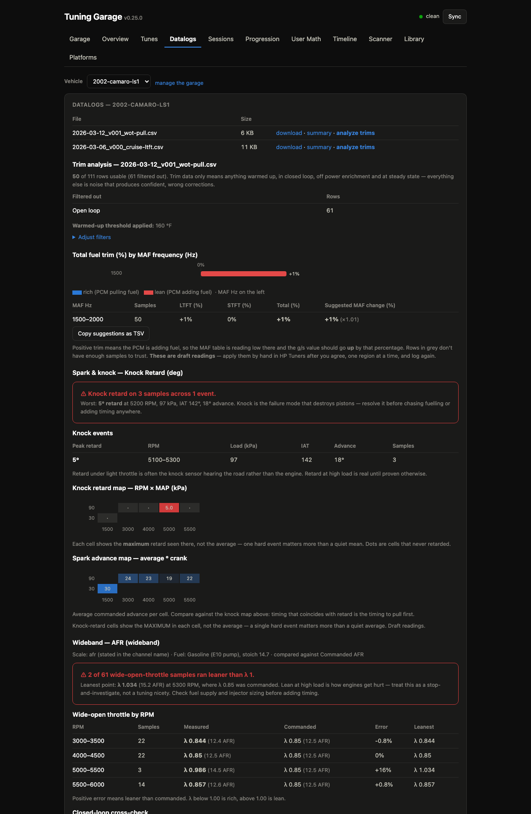

- **Knock retard** is reported first because it destroys hardware where a
  fuelling error only wastes fuel. Cells show the **maximum** retard, never the
  average — a 5° event inside a cell of 30 quiet samples averages to nothing and
  disappears. Retard under light throttle is flagged as possible false knock
  (the sensor hearing the road); retard at high load is real until proven
  otherwise.
- **Wideband** covers what trims cannot: open loop, power enrichment and
  wide-open throttle. Lean is judged against **what the PCM commanded** — a
  warning fires more than 3% leaner than asked, with λ 1.0 as a backstop — so
  λ 0.95 when 0.85 was commanded is caught even though it is richer than
  stoichiometric. Enrichment counts whether or not the throttle reached 80%.
  Lean at high load is a stop-and-investigate: check fuel supply and injector
  capacity before adding any timing.
- **Two stoichiometric ratios**, shown at the top of the wideband section. Your
  wideband's AFR is lambda × the stoich its controller displays (14.7 on most,
  whatever fuel you run); the PCM's commanded AFR is lambda × the PCM's own
  stoich, which the app derives from the log. If your wideband is set to display
  another fuel, change "Wideband displays AFR at" — not the fuel setting, which
  only changes how AFR is shown.
- **The closed-loop cross-check** catches the nasty case where trims look happy
  but the wideband disagrees, which means the O2s or the commanded table are
  suspect and the corrections above shouldn't be trusted yet.

Three more sections appear when the log supports them. All are binned on
**RPM × kPa** — the axes GM indexes the VE and spark tables on — so a cell here
is a cell you can go and look at.

- **MAF vs speed-density** compares the PCM's two airflow estimates against each
  other. Because it compares models rather than fuelling, it needs no wideband
  and no open loop — it is the one VE-relevant view an ordinary closed-loop
  cruise log will give you. Where they diverge is where the MAF table and the VE
  table disagree.
- **Suggested spark change** turns knock retard into the subtraction to make,
  using the maximum in each cell. **If knock coincides with high intake air
  temperature the suggestion is withheld**, because the IAT retard table is then
  the likelier fix and pulling timing would be treating the symptom. Logged
  advance is a blend of the High and Low Octane tables, so it can never be
  attributed to one of them.
- **VE correction** gives a multiplier per cell from measured against commanded
  lambda. It is computed from **open-loop samples only** and refuses outright on
  a closed-loop log — with the trims in control the mixture sits at commanded
  however wrong VE is, so the error reads as zero, and on a MAF-primary tune
  those trims describe the MAF table anyway. Log a WOT pull, or a session with
  the MAF disabled, to get numbers here.

### Step 8 — Apply one change, then log the session

Take **one** suggestion, apply it by hand in your tuning software, and check the
result in as the next revision. Then write the session up on the **Sessions**
tab: what you believed, what you changed, what you expect the next log to show.

That last part is the one people skip and later wish they hadn't.

### Step 9 — Commit and push

Hit **Commit & push**. Your history is now backed up and, if you work on two
machines, waiting for you on the other one.

---

## 6. The rest of the app

**Timeline** — the whole history of a vehicle in one column, and more usefully,
the *gaps*: revisions never flashed, revisions with no datalog, and datalogs
pointing at a revision that was never checked in.

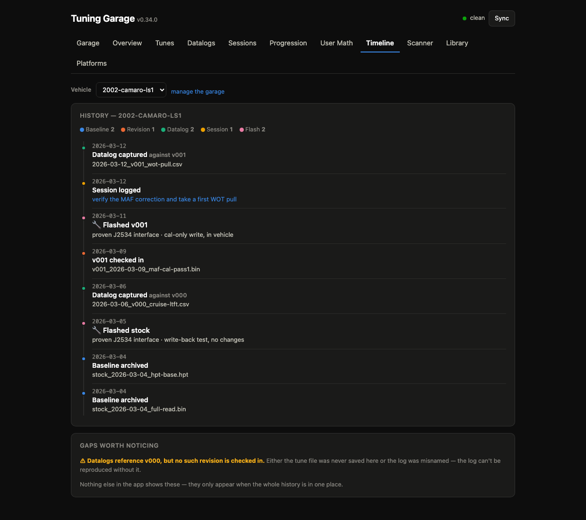

**Progression** — a 30-concept learning tracker. Click a status to cycle
⬜ → 🟡 → 🟢. Only mark something green when you'd trust yourself to do it
unassisted.

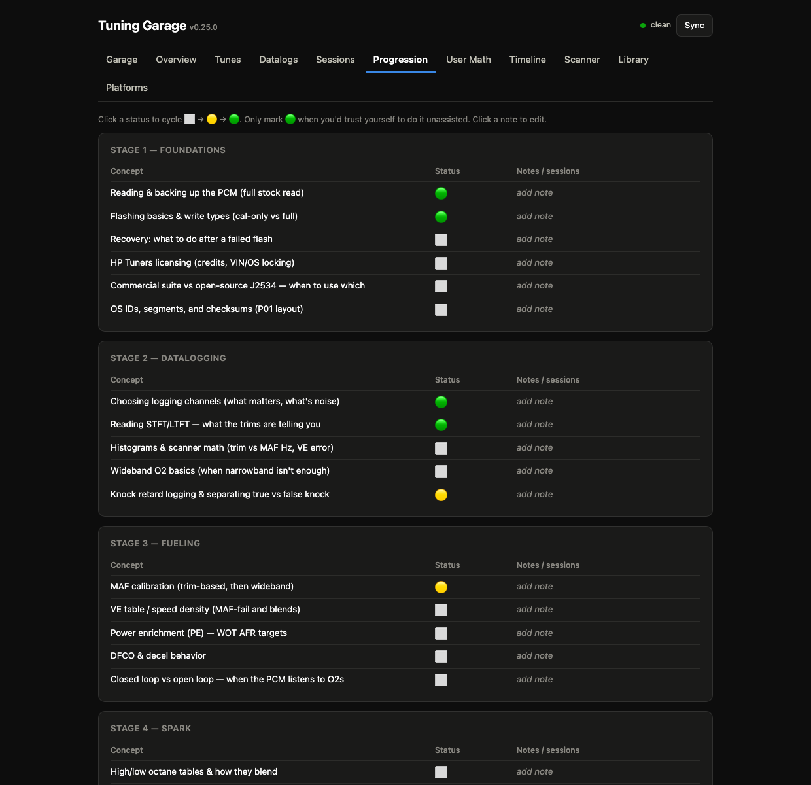

**User Math** — your formula repository. Write formulas by hand, or upload a
`.MathParameter.xml` exported from VCM Scanner's Math Lab and it decodes the
expression against your channel dictionary. Export any entry back out as a
Math Lab file.

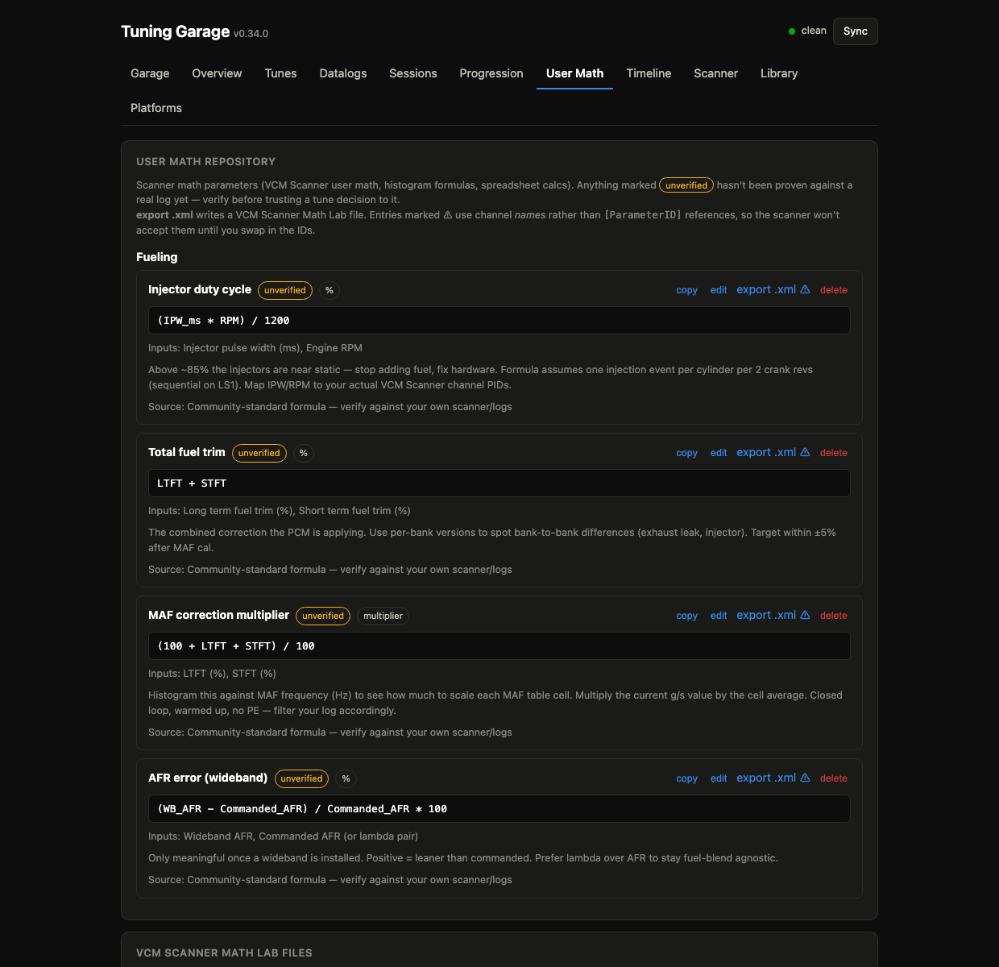

**Scanner** — channel lists, charts, graphs and layouts, stored under their
original names so they load straight back into VCM Scanner. Channel lists are
just numeric parameter IDs, so the app harvests a **dictionary** from whatever
labels appear in your charts and layouts and uses it to name channels
everywhere else. IDs it hasn't learned are shown as unknown, never guessed.

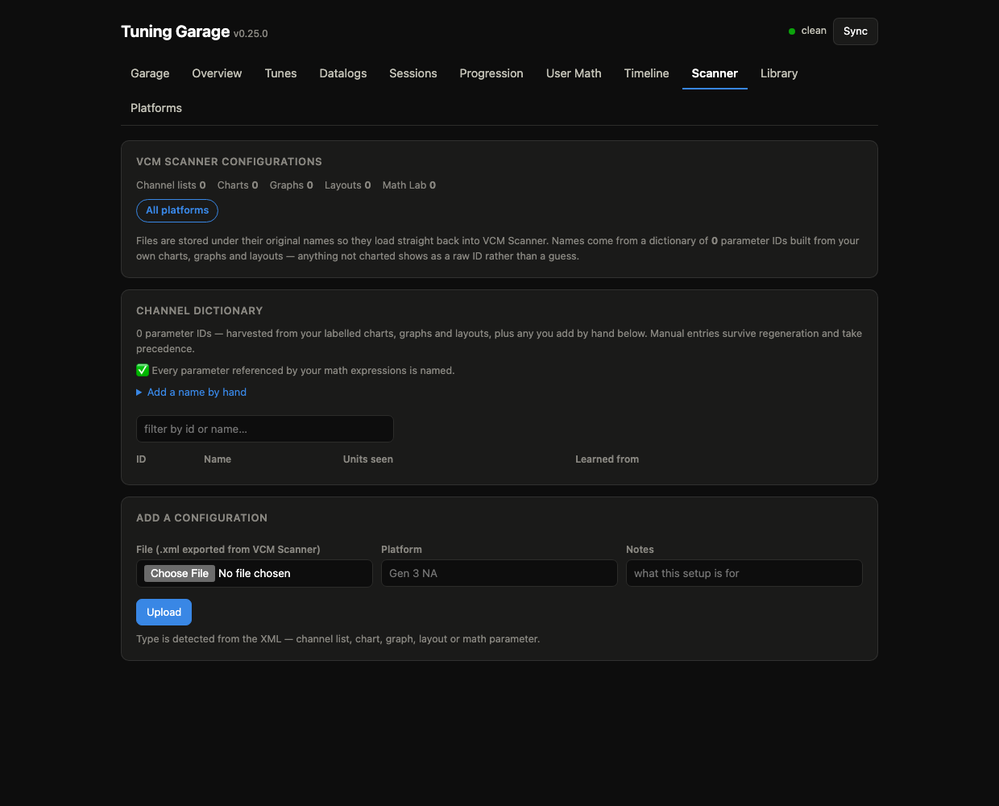

**Library** — donor and practice bins (explicitly *not* any vehicle's
baseline), XDF definitions filed by OS, and every reference document rendered
inline.

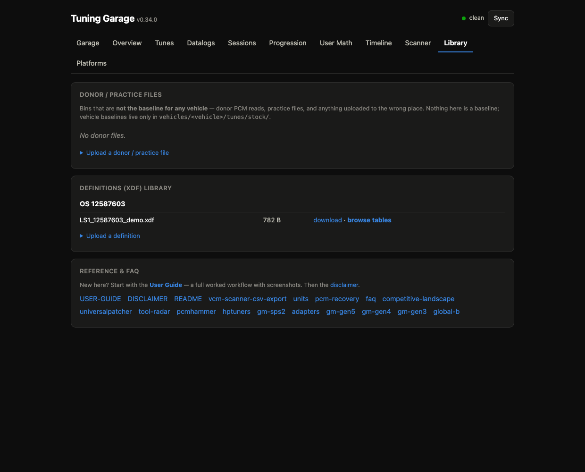

**Platforms** — PCM and adapter matrices for the platforms the app knows about.

---

## 7. Units

Every displayed number states its unit. Log channels take their unit from the
column header; XDF tables keep the definition's units so they match TunerPro;
computed values like fuel trim are always %. The correction multiplier is a
**dimensionless ratio**, not a percentage.

Set display preferences on the Datalogs tab. Anything converted names the unit
it was recorded in — nothing is silently reformatted — and a channel with no
unit in its header is shown as "not stated" rather than assumed.

This matters more than it sounds. The warmed-up filter once compared a
hard-coded `160` against whatever the log used, so a Celsius log had every row
of a fully warm engine discarded as "cold" and returned nothing, silently. Full
contract: [reference/units.md](reference/units.md).

---

## 8. Two machines

Tuning usually happens on a Windows laptop; reading and planning often happen
elsewhere. Git is the sync:

- **Finishing on a machine:** Commit & push.
- **Starting on a machine:** the launcher pulls, or hit **Sync**.
- If a machine is behind, the app shows **⇣ N behind GitHub** and warns you.
- A new release is installed on one machine (section 9); the others get it by
  syncing.

Sync only fast-forwards; it will never silently merge two divergent histories,
because binary tune files cannot be merged.

---

## 9. Updating to a new release

"Use this template" made your repository a copy with **no shared history** with
the project, so `git pull` only ever syncs your own machines. It cannot bring
you a new release. The update script does that.

**Know when there is one.** Your version is in the app's header. On
<https://github.com/ktollison/tuning-garage>, click **Watch → Custom →
Releases** to be told about new ones, or run:

```bash
node scripts/update.mjs --check
```

**Update.** On one machine, Commit & push your work first, then in your Tuning
folder (`cd ~/Tuning` on a Mac, `cd %USERPROFILE%\Tuning` on Windows):

```bash
node scripts/update.mjs
```

It shows the release notes and every file it will change, and asks before
doing anything. Then:

| What | What happens to it |
|---|---|
| Your data — `vehicles/`, `PROGRESSION.md`, `data/user-math.json`, `data/preferences.json`, `vcm-scanner/` configs, `definitions/<OS>/` | **Never touched** |
| A project file you never edited | Replaced with the new version |
| A project file you edited | The release is merged into your version |
| An edit that collides with the release | Yours stays; the new version is saved beside it as `<file>.new` |

It then runs the tests. If they pass it commits "Update Tuning Garage to
x.y.z"; if they fail it undoes every change and tells you. Left with a `.new`
file? Compare the two, keep what you want, and delete the `.new` file.

**Finish.** Press **Commit & push**. The launcher restarts the app by itself
when the version changes. Your **other machines** need no update run: the
launcher pulls the update like any other commit, or press **Sync**.

**Updating from v0.43.0 or earlier?** The script arrived in v0.44.0, so fetch
it once, then run it as above. On a Mac:

```bash
curl -fsSL -o scripts/update.mjs https://raw.githubusercontent.com/ktollison/tuning-garage/main/scripts/update.mjs
```

On Windows (Command Prompt):

```bash
curl -fsSL -o scripts\update.mjs https://raw.githubusercontent.com/ktollison/tuning-garage/main/scripts/update.mjs
```

`--to 0.44.0` installs a specific release instead of the newest.

---

## 10. Troubleshooting

| Symptom | Cause |
|---|---|
| Commit fails: "Author identity unknown" | `git config --global user.name` / `user.email` were never set |
| `'&&' is not a valid statement separator` | PowerShell — run each command on its own line |
| Browser opens to "can't connect" | The launcher waits for the server; if it persists, wait and refresh |
| Analysis says most rows were filtered | Usually correct. Check the rejection table: cold, open loop, PE, or transient |
| Update says "You have uncommitted changes" | Commit & push first, then run it again |
| Update says "Could not reach the project" | No internet, or GitHub is down — try again later |
| Update says the tests failed | Nothing was changed. Report it on [Discussions](https://github.com/ktollison/tuning-garage/discussions) |
| The header still shows the old version after updating | Restart the app: run the launcher again |
| Bin analysis says "no platform module recognises this file" | Not a Gen III GM bin, or a partial read. A P01 full read is exactly 524,288 bytes |
| Compare shows byte counts but no tables | No XDF for that OS in `definitions/<OS>/` |

---

## 11. Cheat sheet

```
Archive the stock read              before touching anything
One change per revision             or you can't attribute the result
Every datalog names its revision    or it's unusable later
Checklist before every write        the server enforces it
Knock outranks fuelling             hardware vs fuel economy
Data quality before conclusions     check what was filtered out
Apply by hand, then re-log          nothing here writes to a tune
Commit and push after each session  the remote is the backup
```

**Regenerating these screenshots** after a UI change:

```bash
node scripts/make-demo.mjs /tmp/tuning-demo
TUNING_REPO=/tmp/tuning-demo node app/server.mjs &
sh scripts/make-screenshots.sh
```

Everything pictured above is a fictional demo vehicle with synthetic files —
no real vehicle data appears in this guide.
